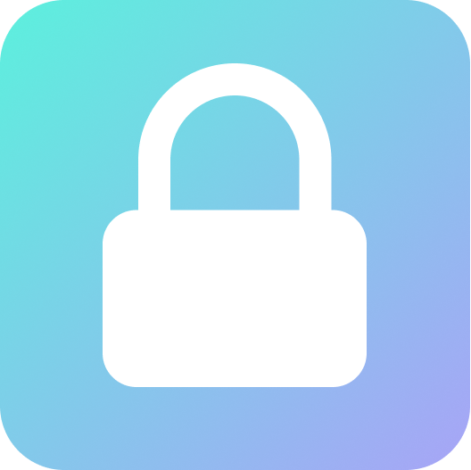

    
    <h1>Password-cli</h1>

# More about Password-cli
Every time we lose the password of some social network and we have to click on "I forgot my password", but we created the password-cli to correct this and keep your password in the most secure way possible, with just a command line you can get your password without any problems and the coolest thing... it's open source! 🥶

# How to install
That simple! You can use:
  * npm: `npm i --global @dockteam/password-cli`
  * yarn: `yarn add global @dockteam/password-cli`

# 🧑‍🤝‍🧑 Contribute
See how to contribute [here](./CONTRIBUTING.md)

# ⚡ Techs used
 * [Typescript](https://github.com/microsoft/TypeScript)
 * Crypto
 * [Inquirer](https://github.com/SBoudrias/Inquirer.js)
 * [Ora](https://github.com/sindresorhus/ora)
 * [Chalk](https://github.com/chalk/chalk)
 * [Commander](https://github.com/tj/commander.js)

# Author

    <a href="https://github.com/pedrinfx">
        
        
pedrinfx

    </a>

